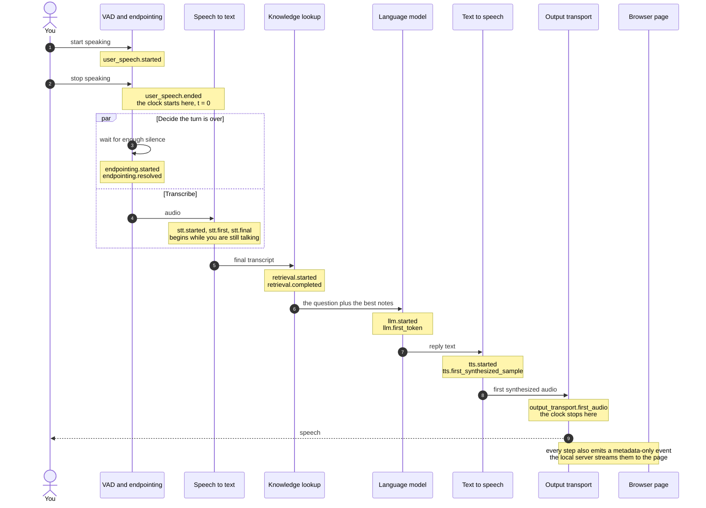

# Where Did My 800 Milliseconds Go?

[](https://github.com/karthikkaiplody/voice-infer-stack/actions/workflows/ci.yml)
[](LICENSE)


A local voice agent you can run on your own machine and watch, stage by stage,
while it answers you. It is a companion to a talk at the
[IEEE RTC Conference 2026](https://rtc-conference.com/conference-schedule) (Real Time
Communications, Illinois Tech, AI in RTC track), and it exists to make one
claim tangible:

> Building a low-latency voice agent is not only a model problem. It is a
> real-time systems problem.


*The page replaying a recorded turn. The numbers in this picture are synthetic,
and the page says so. Yours, from your own machine, appear when you run it live.*

**This is not a benchmark.** There are no leaderboards, no "X is faster than
Y", and no claim about anyone's stack. The numbers you get are yours, from your
hardware, and the point is the *shape* of them.

## Requirements

This release supports **macOS on Apple Silicon only**. Speech-to-text uses MLX
Whisper, which needs it. Other platforms are outside the scope of this release.

| You want | You need |
|---|---|
| Anything | macOS on Apple Silicon, and `make` (it comes with the Xcode command line tools) |
| The page on recorded turns | [uv](https://docs.astral.sh/uv/) (it installs the right Python, 3.12, for you) and [Node.js](https://nodejs.org) 20.19+ or 22.12+ |
| To talk to the agent | [Ollama](https://ollama.com), running, plus the models `make setup` downloads (several GB; the language model alone is about 2 GB), a microphone, and headphones |
| To record your own utterances | `ffmpeg` |

## Quick start

```bash
git clone https://github.com/karthikkaiplody/voice-infer-stack.git
cd voice-infer-stack
```

**1 — See it now: no microphone, no models, no API key.**

```bash
make setup-demo     # Python and Node dependencies
make demo           # then open http://127.0.0.1:8080
```

Pick a scenario and press Replay. These are recorded, synthetic turns, so this
teaches how to read the page, not what your machine does.

**2 — Read a recorded turn with nothing installed.** Only Python 3 is needed:

```bash
python3 -m voice_agent.analysis.budget
```

**3 — Talk to it.**

```bash
make setup          # dependencies and model weights, once
make live           # then open http://127.0.0.1:8080 and press Start listening
```

Wait for it to greet you, then ask it something. Try *"what time do you close on
Sunday?"*, then *"tell me a pirate joke"*, and watch it decline. Use headphones
(see [If it greets you and then never answers](#if-it-greets-you-and-then-never-answers)).

No microphone but you have the models? The same pipeline runs from a WAV file, at
real 20 ms cadence: `make trace`.

## What you will see

One page, one address: http://127.0.0.1:8080. A switch in the header moves it
between recorded turns and your live agent, and the page starts fresh each time
you switch.

The page never draws a stage it did not measure as if it had. Three different
answers look three different ways:


- **Measured**: a bar, drawn from recorded timestamps.
- **Not in this scenario**, or **Not observed**: the stage did not run.
- **Not instrumented**: the source cannot report it. The live agent registers no
  tools, so Tool calls says so.
- **Unavailable**: the number does not exist, for a stated reason. It is never
  shown as 0.

Also on the page:

- **The primary number**: from when you stopped talking to when the output
  transport accepted the first audio.
- **The event log and configuration**: every event the page received, and a safe
  summary of the stack it came from.
- **Tuning** (live only): six latency settings you can change while the agent is
  stopped: the VAD silence window, the speech timeout, the STT safety timer,
  waiting for the transcript, the smart-turn model, and a reply length cap. Each
  has limits and a warning where a value is likely to hurt. Changes apply the next
  time you press Start listening, and the page shows what each one launched as.

`make demo` opens the page on recorded turns and `make live` opens it on the live
agent. They start the same server with the same settings. Switching to live for
the first time takes a few seconds while the agent's code loads, and switching is
refused while the agent is listening, so the microphone is never left running
behind a page that no longer shows it.

## One turn, end to end

Four stages in a chain, and the dependencies between them. An agent that has
notes adds a fifth: a knowledge lookup between endpointing and the model. This is
one turn, with the event each step emits:



The number this project cares about is the time between the two clock marks:
**user speech ended → output transport accepted the first audio.** "Accepted" means
the output transport took the first audio frame. It is not a claim that you heard
it, and `tts.first_synthesized_sample` is a separate, earlier boundary.

<picture>
  <source media="(prefers-color-scheme: dark)" srcset="diagrams/slides/cascade-pipeline.clean.dark.png">
  
</picture>

*The default stack. Every box is swappable from the environment: see
[Part 1 · Swap and see](docs/1-swap-and-see.md). Everything is local:
[Pipecat](https://github.com/pipecat-ai/pipecat) orchestrates, and Whisper, Ollama
and Kokoro are the stages. No API keys, and your audio and words never leave the
machine.*

## Where the numbers come from

Every stage on the page is a **contract event** ([SPANS.md](SPANS.md)). Its
timestamp comes from Pipecat's own OpenTelemetry spans, or from a frame boundary
this repository watches, or, for the knowledge lookup, from the lookup itself.
Nothing is estimated: an event with no measurement behind it is not emitted.

The same run writes its OpenTelemetry spans to `artifacts/live-traces.jsonl`
(replaced on each new server run), so when the conversation is
over:

```bash
uv run python -m voice_agent.analysis.budget --traces artifacts/live-traces.jsonl
```

prints the budget for the turn you just watched. The budget covers turn
detection, speech to text, the model and speech synthesis. It does not include the
knowledge lookup, which takes microseconds. The page and the budget are two views
of the same timestamps.

What the budget of a recorded turn looks like, with nothing installed:

```
  BUDGET  02-medium  ·  file  ·  median of 3 runs: 1671 ms
  ------------------------------------------------------------------
  stage                    ms    share
  turn_detection         1102      66%   waiting, not computing
  stt                    1042      62%   cannot overlap (segmented)
  llm                     218      13%
  tts                     350      21%

  against the 800 ms human window: 2.1x over
```

The first row is the one to sit with. It burns no FLOPs, it is two config
constants, and it is the largest line in that budget by a distance. The shares
add up to more than 100% because the stages overlap; that is the second thing to
sit with. Those are one machine's numbers, on one utterance, and they are not
yours. The committed number is also a legacy measurement ending at the first
synthesized sample, so the readers label it as not comparable to corrected
`output_transport.first_audio` measurements.

## Privacy

Telemetry is metadata-only by default. Raw audio, transcripts, prompts,
generated text, TTS text, tool arguments and results, raw errors, credentials,
and machine identifiers are not written to the trace file, not sent to the
browser, and not printed to the console at its default log level. The words you
speak and the words the agent answers with are handled by the models on your
machine and are not recorded. See [the versioned contract](SPANS.md).

The server listens on `127.0.0.1` only, and rejects requests whose Host or Origin
is not local.

## Live mode notes

**Wear headphones.** Microphone and speakers on one machine with no acoustic
echo cancellation means the agent hears itself: its own voice trips voice
activity detection and its own words come back through speech-to-text as your
next question. The pipeline mutes the microphone while the bot speaks, which
stops the loop, but headphones remove the problem rather than managing it.

### If it greets you and then never answers

The microphone is the first suspect, not the pipeline. The greeting is the agent
talking; it says nothing about whether anything is being heard. When the input is
*exactly* silent for a couple of seconds, the page says so. The usual cause is a
system default input that is a virtual device (a mixer or loopback) with nothing
routed to it. `make devices` lists the inputs; pick the real microphone by its
number:

```bash
make devices                       # find the microphone's number
VOICE_AUDIO_DEVICE=3 make live
```

A microphone that is heard but never crosses the voice-activity gate
(`VOICE_VAD_MIN_VOLUME`, default 0.3) looks the same from the page and is not
detected: try a lower value.

### The library agent

`make live` runs an agent whose notes are a small library's opening hours, loans
and fines. It says hello when you start, looks up its notes before each answer,
and answers only from them. The notes live in [`agents/library/`](agents/library/),
and [`agents/README.md`](agents/README.md) shows how to write your own agent.

## The guide, in order

Four short parts. Each stands alone; together they are the talk, written down.

| Part | What it teaches |
|---|---|
| [1 · Swap and see](docs/1-swap-and-see.md) | Every component is one environment variable. Three guided swaps, each moving the budget in a different way. |
| [2 · What to notice](docs/2-what-to-notice.md) | The three insights: the biggest line item does no computing, you cannot just turn it down, and two default timeouts can cost more than any model. |
| [3 · How the measurement works](docs/3-measurement.md) | The rules that keep the numbers honest, and how to point the budget tool at your own agent. |
| [4 · From here to production](docs/4-to-production.md) | The map from this teaching stack to the other eighty percent: barge-in, networks, fleets, evals. |

## Where things live

```
voice_agent/     the Python code, split by what it is for (start here)
tests/           Python tests, in folders that match voice_agent/
ui/              the browser page (React + TypeScript), and its tests
agents/          one folder per agent: its prompt and its notes
fixtures/        synthetic audio, and recorded contract events
telemetry_contract/   the event contract, as a JSON Schema
docs/            the guide
```

The full folder tour and a one-line description of every file are in the
[repo map](docs/repo-map.md). To run everything the project checks:

```bash
make test-all       # the Python tests, then the page's type-check, tests and build
```

## Contributing and security

Contributions are welcome. Read [CONTRIBUTING.md](CONTRIBUTING.md) first; the one
rule that matters is that nothing which could contain a person's speech or
machine details is ever committed. To report a problem that involves privacy or
security, follow [SECURITY.md](SECURITY.md) rather than opening a public issue.

## License

[MIT](LICENSE).

The models this project downloads are not part of this repository and are not
covered by its license. Whisper (through MLX), Kokoro, Silero VAD, Pipecat's
smart-turn model, and the Llama 3.2 model that Ollama serves are each fetched on
first use under their own terms; read them before you redistribute anything built
on them. The audio in `fixtures/audio/` is synthetic speech generated locally with
Kokoro and contains no real person's voice.
