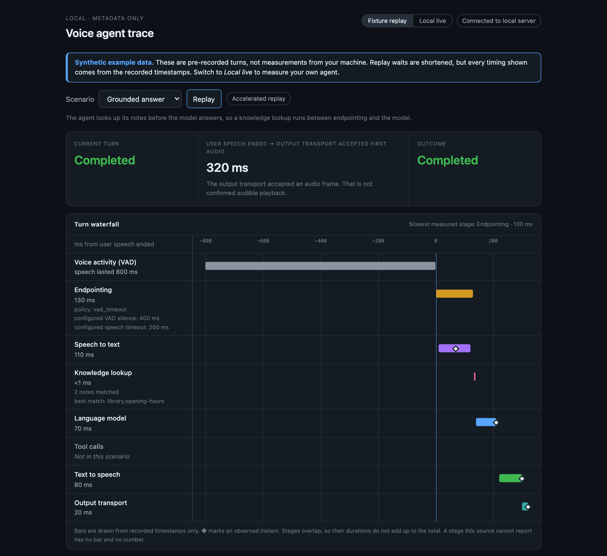
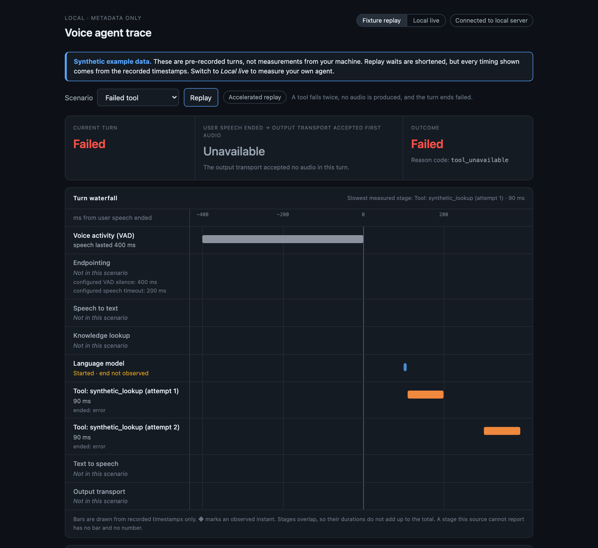

# Where Did My 800 Milliseconds Go?

[](https://github.com/karthikkaiplody/voice-infer-stack/actions/workflows/ci.yml)
[](LICENSE)


Watch where every millisecond of a voice agent's turn goes. A local
[Pipecat](https://github.com/pipecat-ai/pipecat) agent, a live observability page,
and a metadata-only telemetry contract, all on your own Mac. The companion to a
talk at the [IEEE RTC Conference 2026](https://rtc-conference.com/conference-schedule).

> Building a low-latency voice agent is not only a model problem. It is a
> real-time systems problem.



<sub>A recorded, synthetic turn. The page says so; your own numbers appear when you run it live.</sub>

## Quick start

macOS on Apple Silicon only. You need [Homebrew](https://brew.sh), [uv](https://docs.astral.sh/uv/) and [Node.js](https://nodejs.org) 20.19+ or 22.12+. If Node is missing or too old, `make` stops at once and says how to install one.

```bash
git clone https://github.com/karthikkaiplody/voice-infer-stack.git
cd voice-infer-stack
brew install portaudio
make setup-demo && make demo      # then open http://127.0.0.1:8080
```

The page opens on a recorded, synthetic turn and replays it by itself; the
Scenario menu picks another, including one where the agent answers too early.
No microphone, no models, no API key.

<details>
<summary><b>Talk to the agent live</b></summary>

<br>

Needs [Ollama](https://ollama.com) running, a microphone, and headphones.

```bash
make setup          # dependencies and model weights, once (several GB)
make live           # then open http://127.0.0.1:8080 and press Start listening
```

Wait for it to greet you, then ask *"what time do you close on Sunday?"*. If it
greets you and never answers, see [Live mode](docs/live-mode.md).

</details>

<details>
<summary><b>Read a recorded turn with nothing installed</b></summary>

<br>

Only Python 3 is needed, and nothing is downloaded:

```bash
python3 -m voice_agent.analysis.budget
```

</details>

<details>
<summary><b>Full requirements</b></summary>

<br>

| You want | You need |
|---|---|
| Anything | macOS on Apple Silicon (speech-to-text uses MLX Whisper), [Homebrew](https://brew.sh), and `make` (from the Xcode command line tools) |
| The page on recorded turns | `brew install portaudio` (PyAudio has no prebuilt macOS wheel and compiles against it), [uv](https://docs.astral.sh/uv/) (it installs Python 3.12 for you), and [Node.js](https://nodejs.org) 20.19+ or 22.12+ |
| To talk to the agent | [Ollama](https://ollama.com), running, plus the models `make setup` downloads (several GB; the language model alone is about 2 GB), a microphone, and headphones |
| To record your own utterances | `ffmpeg` |

Other platforms are outside the scope of this release.

</details>

## What you will see

- **A waterfall of the turn**, one row per stage: voice activity, endpointing,
  speech to text, a knowledge lookup, the language model, text to speech, and the
  output transport.
- **One number**: from when you stopped talking to when the output transport
  accepted the first audio.
- **Honest states.** A stage it did not measure is never drawn as zero.
- **A switch** between recorded turns and your live agent, plus an event log, a safe
  configuration summary, and a tuning panel for six latency settings.

<details>
<summary><b>How a stage that was not measured looks</b></summary>

<br>



- **Measured**: a bar, drawn from recorded timestamps.
- **Not in this scenario**, or **Not observed**: the stage did not run.
- **Not instrumented**: the source cannot report it. The live agent registers no
  tools, so Tool calls says so.
- **Unavailable**: the number does not exist, for a stated reason. It is never
  shown as 0.

</details>

## Go deeper

| | |
|---|---|
| [How it works](docs/how-it-works.md) | One turn as a sequence diagram, where the numbers come from, and what is and is not recorded |
| [Live mode](docs/live-mode.md) | Talking to the agent, the tuning panel, and what to check when nothing happens |
| [The guide, in four parts](docs/1-swap-and-see.md) | Swap any component with one variable, and what to notice when you do |
| [The event contract](SPANS.md) | Every event and attribute, and what to emit for your own agent |
| [Write your own agent](agents/README.md) | A prompt, a greeting and a markdown file of notes |
| [Repo map](docs/repo-map.md) | Every folder and file, in one line each |

## About this release

This release is a local teaching companion: a page, a pipeline and a contract you
can run and read on one Mac. The live agent registers no tools and mutes the
microphone while it speaks, so tool calls and interrupted turns appear only in the
recorded scenarios. It does not include cloud deployment, saved trace history,
auth, a hosted service, or support for other platforms. The [changelog](CHANGELOG.md)
has the full list.

[Contributing](CONTRIBUTING.md) · [Security](SECURITY.md) · [MIT license](LICENSE)

<details>
<summary><b>About the models</b></summary>

<br>

The models this project downloads are not part of this repository and are not
covered by its license. Whisper (through MLX), Kokoro, Silero VAD, Pipecat's
smart-turn model, and the Llama 3.2 model that Ollama serves are each fetched on
first use under their own terms; read them before you redistribute anything built
on them. The audio in `fixtures/audio/` is synthetic speech generated locally with
Kokoro and contains no real person's voice.

</details>
