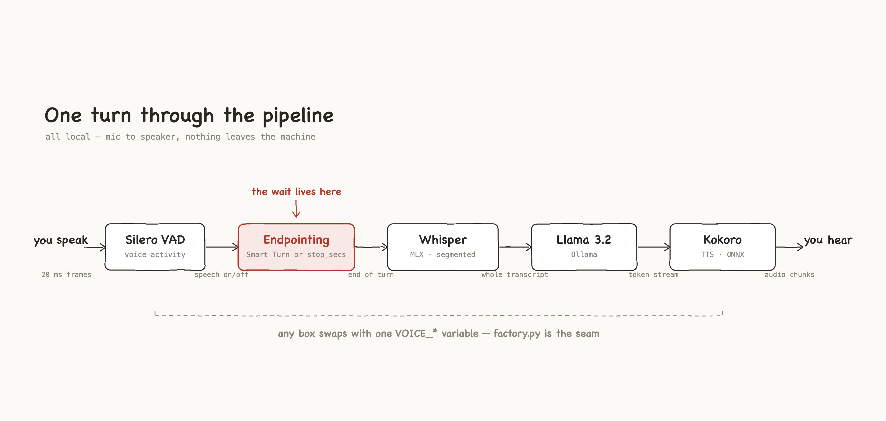

# Where Did My 800 Milliseconds Go?

A local voice agent you can run on your own machine and watch, stage by stage,
while it answers you. It is a companion to a talk at the
[IEEE RTC Conference 2026](https://rtc-conference.com/conference-schedule) (Real Time
Communications, Illinois Tech, AI in RTC track), and it exists to make one
claim tangible:

> Building a low-latency voice agent is not only a model problem. It is a
> real-time systems problem.

Four stages in a chain, and the dependencies between them. (An agent that has
notes adds a fifth: a knowledge lookup between endpointing and the model.)

```
  you speak ─► voice activity ─► endpointing ─► speech to text
                                                     │
                       playback ◄─ text to speech ◄─ language model
```

Everything is local: [Pipecat](https://github.com/pipecat-ai/pipecat) as the
orchestrator, Whisper, Ollama and Kokoro as the stages. No API keys, nothing
leaves the machine.

<picture>
  <source media="(prefers-color-scheme: dark)" srcset="diagrams/slides/cascade-pipeline.clean.dark.png">
  
</picture>

*The default stack, stage by stage. Every box is swappable from the
environment — see [Part 1 · Swap and see](docs/1-swap-and-see.md).*

**This is not a benchmark.** There are no leaderboards, no "X is faster than
Y", and no claim about anyone's stack. The numbers you get are yours, from your
hardware, and the point is the *shape* of them.

## Start here

Three commands, in order. Each one teaches something the previous one could not.

```bash
python3 -m voice_agent.analysis.budget   # 1. read a recorded turn. No install. No models.
make setup                 # 2. deps and model weights (once, ~4 GB)
make live                  # 3. talk to it, and watch the latency arrive
```

**1 — where the time goes, with nothing installed.** Not "without installing
models": without installing *anything*. The traces are committed, and
`analysis/budget.py`, `measurement.py` and `viewer.py` are pure standard library, tested on
the Python 3.9 that ships with macOS.

```
  BUDGET  02-medium  ·  file  ·  median of 3 runs: 1671 ms
  ------------------------------------------------------------------
  stage                    ms    share
  turn_detection         1102      66%   waiting, not computing
  stt                    1042      62%   cannot overlap (segmented)
  llm                     218      13%
  tts                     350      21%

  against the 800 ms human window: 2.1x over
```

The first row is the one to sit with. It burns no FLOPs, it is two config
constants, and it is the largest line in that budget by a distance. The shares
add up to more than 100% because the stages overlap; that is the second thing
to sit with.

Those are one machine's numbers, on one utterance, and they are not yours.
The committed number is also a legacy measurement ending at the first
synthesized sample. The readers label it as not comparable to corrected
`output_transport.first_audio` measurements.

**2 — install.** Needs [uv](https://docs.astral.sh/uv/),
[Ollama](https://ollama.com) and ffmpeg. Everything else downloads on first run.

**3 — watch it happen.** `make live`, then open http://127.0.0.1:8080, press
start, wait for it to greet you, and ask it something. (No microphone or models
yet? The switch in the header replays recorded turns.) The page draws the turn as a waterfall
while it runs: when your turn was declared over, when model work ran, when the first
synthesized sample existed, and when the output transport accepted audio.

Every bar on that page is an OpenTelemetry span, streamed to the browser as
Pipecat emits it and drawn at its real start and end. They are the same spans
written to `artifacts/live-traces.jsonl`, so when the conversation is over:

```bash
uv run python -m voice_agent.analysis.budget --traces artifacts/live-traces.jsonl
```

prints the budget for the turn you just watched. The page and the number cannot
disagree, because there is only one measurement.

Telemetry is metadata-only by default. Provider payloads are filtered before
they reach the trace file or browser, so raw audio, transcripts, prompts,
generated text, TTS text, tool arguments/results, raw errors, credentials, and
machine identifiers are not persisted or displayed. The primary output metric
is `output_transport.first_audio`: the transport accepted a frame. It is not a
claim that the user heard playback. See [the versioned contract](SPANS.md).

**No microphone?** The same pipeline runs from a WAV file, at real 20 ms
cadence: `make trace`. Details in [Part 1](docs/1-swap-and-see.md).

**Wear headphones.** Microphone and speakers on one machine with no acoustic
echo cancellation means the agent hears itself: its own voice trips voice
activity detection and its own words come back through speech-to-text as your
next question. The pipeline mutes the microphone while the bot speaks, which
stops the loop, but headphones remove the problem rather than managing it.

**If it greets you and then never answers**, the microphone is the first suspect,
not the pipeline. The greeting is the agent talking; it says nothing about
whether anything is being heard. When the input is *exactly* silent for a couple
of seconds, the page says so. The usual cause is a system default input that is a
virtual device (Elgato Wave Link's "Chat Mix", a loopback) with nothing routed to
it. `make devices` lists the inputs; pick the real microphone by its number:

```bash
make devices                       # find the microphone's number
VOICE_AUDIO_DEVICE=3 make live
```

A microphone that is heard but never crosses the voice-activity gate
(`VOICE_VAD_MIN_VOLUME`, default 0.3) looks the same from the page and is not
detected: try a lower value.

## The browser page

One page, one address: http://127.0.0.1:8080. A switch in the header moves it
between two sources, and the page starts fresh each time you switch.

| | Fixture replay | Local live |
|---|---|---|
| Needs | Nothing installed beyond `make setup-demo` | Models, Ollama, a microphone |
| What you see | Five recorded scenarios you can replay: a normal turn, a slow tool, an interrupted turn, a failed tool, and a grounded answer | Your own conversation, as it happens |
| Numbers | Synthetic, from `fixtures/telemetry/`, and replayed faster than real time. A banner at the top of the page says so | Measured on your machine |

`make demo` opens the page on the fixtures and `make live` opens it on the live
agent. They start the same server with the same settings; only the starting
source differs. Switching to live for the first time takes a few seconds while
the agent's code loads. Switching is refused while the agent is listening, so
the microphone is never left running behind a page that no longer shows it.

What is on the page:

- **The waterfall**, one row per stage: voice activity, endpointing, speech to
  text, **knowledge lookup**, language model, tool calls, text to speech, output
  transport. A stage the source cannot measure says *Not instrumented*. A stage
  that did not run says *Not in this scenario* or *Not observed*. Neither is
  ever drawn as zero.
- **The primary number**: from when you stopped talking to when the output
  transport accepted the first audio.
- **The header**: fixture or live, and in live mode which agent is answering.
- **The event log and configuration**: every event the page received, and the
  safe summary of the stack it came from.
- **Tuning** (live only): six latency settings you can change while the agent is
  stopped: the VAD silence window, the speech timeout, the STT safety timer,
  waiting for the transcript, the smart-turn model, and a reply length cap. Each
  has limits and a warning where a value is likely to hurt. Changes apply the next
  time you press Start listening, and the page shows what each one launched as.

`make live` runs the **library agent**: it says hello when you start, looks up
its notes before each answer, and answers only from them. Try *"what time do you
close on Sunday?"*, *"how long can I keep a book?"*, then *"tell me a pirate
joke"* and watch it decline. The notes live in
[`agents/library/`](agents/library/), and [`agents/README.md`](agents/README.md)
shows how to write your own agent.

## The guide, in order

Four short parts. Each stands alone; together they are the talk, written down.

| Part | What it teaches |
|---|---|
| [1 · Swap and see](docs/1-swap-and-see.md) | Every component is one environment variable. Three guided swaps, each moving the budget in a different way. |
| [2 · What to notice](docs/2-what-to-notice.md) | The three insights: the biggest line item does no computing, you cannot just turn it down, and two default timeouts can cost more than any model. |
| [3 · How the measurement works](docs/3-measurement.md) | The rules that keep the numbers honest, and how to point `budget.py` at your own agent. |
| [4 · From here to production](docs/4-to-production.md) | The map from this teaching stack to the other eighty percent: barge-in, networks, fleets, evals. |

## Where things live

```
voice_agent/     the Python code, split by what it is for (start here)
  config.py        every model, rate, prompt and threshold, in one frozen object
  paths.py         every folder and file the code reads or writes
  pipeline/        the voice agent: audio in, spoken answer out
  knowledge/       what the agent knows, and how it looks things up
  telemetry/       how a turn is measured, and what may be reported
  server/          the local web server behind the browser UI
  analysis/        read recorded turns (standard library only)
  tools/           one-off scripts: record your voice, regenerate test audio
tests/           Python tests, in folders that match voice_agent/
ui/              the browser page (React + TypeScript)
  src/             the page itself
  tests/           the page's tests, in folders that match src/
agents/          one folder per agent: its prompt and its notes (edit these)
fixtures/        audio/ (WAV utterances)  telemetry/ (recorded contract events)
telemetry_contract/   the event contract, as a JSON Schema
artifacts/       recorded turns everyone can read
docs/            the four-part guide     diagrams/   the diagrams, as HTML
```

Every folder under `voice_agent/` opens with a docstring that lists its files, so
`voice_agent/pipeline/__init__.py` is the quickest way to see what is in it.

| File | What it does |
|---|---|
| `voice_agent/pipeline/agent.py` | The pipeline: which stages, in what order, and what decides your turn is over. Used by both ways of running it. |
| `voice_agent/pipeline/factory.py` | Builds each stage from config. The seam that makes components swappable. |
| `voice_agent/pipeline/wav_transport.py` | Feeds a WAV into Pipecat at real 20 ms cadence, for running without a microphone. |
| `voice_agent/pipeline/warm.py` | Pre-downloads model weights so the first run is not a cold surprise. |
| `voice_agent/knowledge/agents.py` | Loads an agent from `agents/<name>/`: prompt, greeting and notes. |
| `voice_agent/knowledge/search.py` | Splits notes into passages and ranks them against a question. |
| `voice_agent/knowledge/retrieval.py` | The stage that puts the best notes in front of the model. |
| `voice_agent/telemetry/contract.py` | Contract validation, stable identity, immutable safe configuration snapshots, and privacy filtering. |
| `voice_agent/telemetry/tracing.py` | OpenTelemetry wiring, metadata filtering, and the timing boundaries Pipecat does not emit. |
| `voice_agent/telemetry/runtime_events.py` | Turns what Pipecat does into contract events while the agent runs. |
| `voice_agent/server/live.py` | The server behind `make live` and `make demo`: serves the page and streams events to it. |
| `voice_agent/server/tuning.py` | The few settings the page may change, with limits and warnings. |
| `voice_agent/analysis/budget.py` | Reads a trace file, prints the per-stage budget. |
| `voice_agent/analysis/measurement.py` | Span interval maths: overlap, union, median. |
| `voice_agent/analysis/viewer.py` | Renders one recorded turn as a standalone HTML waterfall. |
| `voice_agent/tools/record.py`, `make_fixtures.py` | Record your own utterance, or generate one locally. |
| `tests/analysis/test_measurements.py` | Invariants that catch a number that is quietly wrong. |
| `Makefile` | Every entry point: `make live`, `make demo`, `make trace`, `make budget`, `make test-all`. |
| `SPANS.md` | The span contract `budget.py` reads. What to emit for your own agent. |

## Setup notes

The initial release supports macOS only. Apple Silicon is the tested path (MLX
Whisper, CoreML, MPS). Other platforms are outside the initial support scope.

## Licence

MIT.
