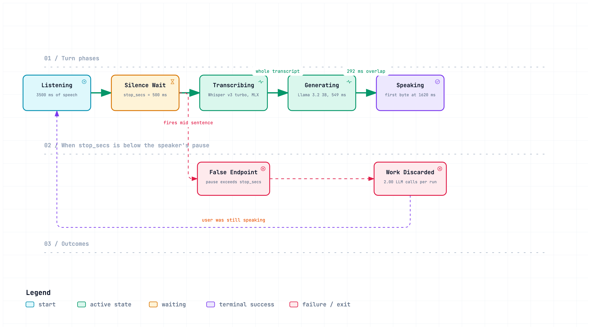
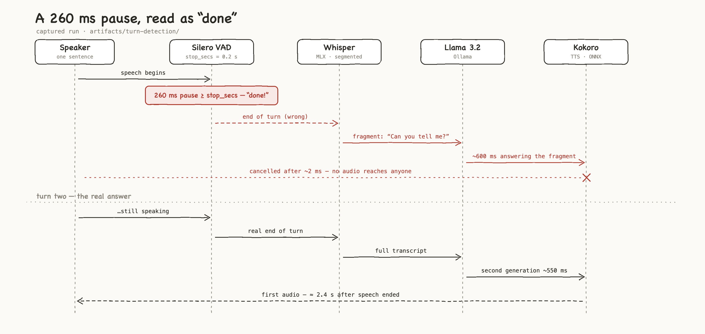

# Part 2 · What to notice

*Part 2 of the companion guide · [← Part 1 · Swap and see](1-swap-and-see.md) · [Part 3 · How the measurement works →](3-measurement.md)*

Three things worth noticing once you have run a turn. Each is visible in the
traces, each is a systems effect rather than a model property, and together
they are the argument of the talk.

## 1. The biggest line item does no computing

`stop_secs` is how long the agent waits in silence before deciding you have
finished speaking. It burns no FLOPs, it is a config constant, and most people
never open it. On the live page it is the first bar, and it usually starts
before anything else is allowed to run.

<picture>
  <source media="(prefers-color-scheme: dark)" srcset="../diagrams/slides/turn-timeline.clean.dark.png">
  
</picture>

## 2. You cannot just turn it down

Below the length of a speaker's natural pause, the detector fires mid-sentence,
the agent answers a fragment, and the work is thrown away. Turning the timeout
down can make the turn *slower*, because a discarded generation costs more than
the wait it saved. The live page shows this directly: a stage that ran twice in
one turn is marked, because the first one was wasted. A captured example, with
every run laid out span by span, is in
[`artifacts/turn-detection/`](../artifacts/turn-detection/). It was recorded
before the span contract in [`SPANS.md`](../SPANS.md) existed, so `analysis/viewer.py`
cannot draw it; to see a false endpoint as a waterfall, cut the silence dial
yourself — [swap 2 in Part 1](1-swap-and-see.md#three-swaps-to-try-in-order).

<picture>
  <source media="(prefers-color-scheme: dark)" srcset="../diagrams/slides/false-endpoint.clean.dark.png">
  
</picture>

## 3. Two default timeouts can cost more than any model

Pipecat closes a turn when **two** timers, started together, have both
finished:

| Timer | Default | What it is |
|---|---|---|
| `ttfs_p99_latency` | **1.0 s** | safety net for how long speech-to-text takes to return a final transcript. A conservative catch-all for local models, whose speed depends entirely on your hardware — hosted services ship measured values instead. Unset by default, so the fallback applies, and it logs a warning most people never read. |
| `user_speech_timeout` | **0.6 s** | policy window in which the user may resume speaking. A pause policy, not a network allowance. |

The safety net is short-circuited the moment speech-to-text flags a transcript
as final, so the full second is the worst case, not the design. But Whisper
tiny returns in about 60 ms locally, and the worst case is what an unflagged
transcript gets you: the pipeline waiting up to a second for something that
had already arrived. `make live` sets both honestly for a local stack; set
them back and watch the first row grow. (Pipecat will log that the STT wait
"collapsed to 0s". That is the point, not a bug.)

## Also on the page: the lookup is not the problem

The library agent looks up its notes before it answers, and the page draws that
as its own row, *Knowledge lookup*, between endpointing and the language model.
It is a local word-matching search, and on the library's notes it takes a few
microseconds, which the page shows as *\<1 ms*. Adding knowledge to an agent does
not cost time on the clock at that step.

What can cost time is what you hand the model afterwards: more notes are a
longer prompt to read, so the *Language model* row is where a bigger
`VOICE_RETRIEVAL_TOP_K` shows up. Hosted retrieval, which crosses a network to a
vector database, would be a different row with a very different length. The row
is there so that when you add one, you can see it.

---

*Next: [Part 3 · How the measurement works →](3-measurement.md)*
