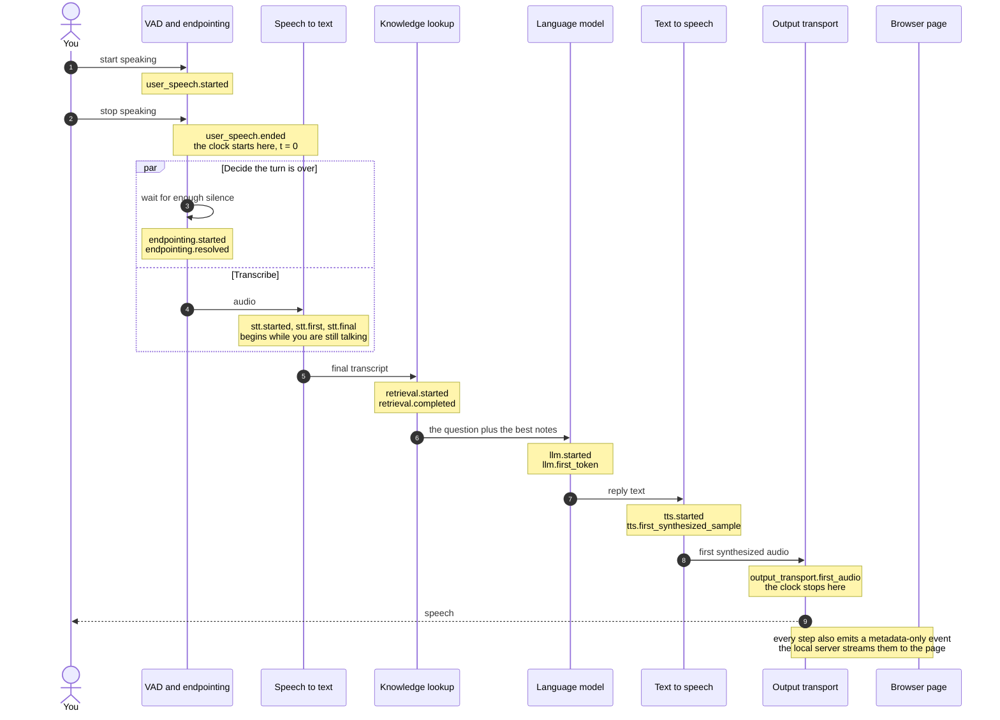

# How it works

*[← README](../README.md) · [Live mode →](live-mode.md)*

One turn from your voice to the agent's first audio, where the numbers on the page
come from, and what is and is not recorded.

## One turn, end to end

Four stages in a chain, and the dependencies between them. An agent that has
notes adds a fifth: a knowledge lookup between endpointing and the model. This is
one turn, with the event each step emits:



The number this project cares about is the time between the two clock marks:
**user speech ended → output transport accepted the first audio.** "Accepted" means
the output transport took the first audio frame. It is not a claim that you heard
it, and `tts.first_synthesized_sample` is a separate, earlier boundary.

<picture>
  <source media="(prefers-color-scheme: dark)" srcset="../diagrams/slides/cascade-pipeline.clean.dark.png">
  
</picture>

*The default stack. Every box is swappable from the environment: see
[Part 1 · Swap and see](1-swap-and-see.md). Everything is local:
[Pipecat](https://github.com/pipecat-ai/pipecat) orchestrates, and Whisper, Ollama
and Kokoro are the stages. No API keys, and your audio and words never leave the
machine.*

## Where the numbers come from

Every stage on the page is a **contract event** ([SPANS.md](../SPANS.md)). Its
timestamp comes from Pipecat's own OpenTelemetry spans, or from a frame boundary
this repository watches, or, for the knowledge lookup, from the lookup itself.
Nothing is estimated: an event with no measurement behind it is not emitted.

The same run writes its OpenTelemetry spans to `artifacts/live-traces.jsonl`
(replaced on each new server run), so when the conversation is over:

```bash
uv run python -m voice_agent.analysis.budget --traces artifacts/live-traces.jsonl
```

prints the budget for the turn you just watched. The budget covers turn
detection, speech to text, the model and speech synthesis. It does not include the
knowledge lookup, which takes microseconds. The page and the budget are two views
of the same timestamps.

What the budget of a recorded turn looks like, with nothing installed
(`python3 -m voice_agent.analysis.budget`):

```
  BUDGET  02-medium  ·  file  ·  median of 3 runs: 1671 ms
  ------------------------------------------------------------------
  stage                    ms    share
  turn_detection         1102      66%   waiting, not computing
  stt                    1042      62%   cannot overlap (segmented)
  llm                     218      13%
  tts                     350      21%

  against the 800 ms human window: 2.1x over
```

The first row is the one to sit with. It burns no FLOPs, it is two config
constants, and it is the largest line in that budget by a distance. The shares
add up to more than 100% because the stages overlap; that is the second thing to
sit with. Those are one machine's numbers, on one utterance, and they are not
yours. The committed number is also a legacy measurement ending at the first
synthesized sample, so the readers label it as not comparable to corrected
`output_transport.first_audio` measurements.

## Privacy

Telemetry is metadata-only by default. Raw audio, transcripts, prompts,
generated text, TTS text, tool arguments and results, raw errors, credentials,
and machine identifiers are not written to the trace file, not sent to the
browser, and not printed to the console at its default log level. The words you
speak and the words the agent answers with are handled by the models on your
machine and are not recorded. See [the versioned contract](../SPANS.md).

The server listens on `127.0.0.1` only, and rejects requests whose Host or Origin
is not local.
